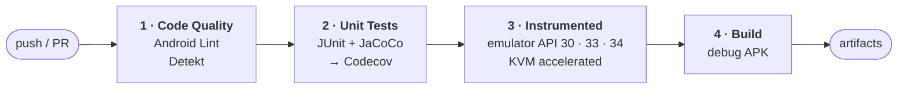

# cicdapp — Android CI/CD reference pipeline

[](https://github.com/AhmedZaeem/cicdapp/actions/workflows/android-ci.yml)
[](https://kotlinlang.org)
[](https://developer.android.com/jetpack/compose)
[](https://openjdk.org)

A small Jetpack Compose shopping app that exists to carry a **complete four-stage Android
CI pipeline**. The app is the specimen; the pipeline is the project.

---

## The pipeline



Every stage uploads its report as a build artifact, so a red build tells you *what* failed
without opening a log.

| Stage | Does | Publishes |
|---|---|---|
| Code Quality | Android Lint, Detekt static analysis | `lint-results`, `detekt-results` |
| Unit Tests | JUnit via Gradle, JaCoCo coverage | `unit-test-results`, Codecov upload |
| Instrumented Tests | Espresso on emulators, API 30 / 33 / 34 | test results per API level |
| Build | Assembles the debug APK | `app-debug.apk` |

Instrumented tests run across a **matrix of three API levels** with KVM enabled on the
runner, so hardware acceleration makes emulator startup viable in CI rather than timing out.

---

## The app under test

```
com/example/cicdapp/
├── MainActivity.kt
├── data/
│   ├── Product.kt              product model
│   ├── CartItem.kt             line item
│   └── ProductRepository.kt    in-memory catalog
├── viewmodel/
│   └── CartViewModel.kt        cart state, the main unit-test target
└── ui/
    ├── screens/                ProductList · ProductDetail · Cart
    └── theme/                  Color · Type · Theme
```

Unit tests cover `CartViewModel` and `ProductRepository` — the two pieces holding logic
worth asserting on. Compose screens are exercised by the instrumented suite.

---

## Running it

```bash
./gradlew assembleDebug      # build
./gradlew test               # unit tests
./gradlew lint detekt        # static analysis
./gradlew connectedCheck     # instrumented, needs a device or emulator
```

Or open the project in Android Studio and run it.

---

## What went wrong building this

Kept here because these cost real time and the fixes are not obvious:

**`actions/upload-artifact@v3` is dead.** GitHub doesn't warn — it fails the entire
workflow. Every action had to move to v4 together: `checkout`, `setup-java`,
`upload-artifact`, `codecov-action`. About twenty minutes went into working out why a
green pipeline suddenly wouldn't start.

**Detekt's default rules reject Compose outright.** Composable functions start with a
capital letter, which trips `FunctionNaming`. The fix is to widen the pattern to
`[a-zA-Z][a-zA-Z0-9]*`. `LongMethod` also needed raising to 150 — Compose functions are
genuinely long once nesting is counted, and the default threshold flags idiomatic code.

**Detekt's config had a `formatting` block that doesn't exist** unless the formatting
plugin is installed. Removed.

**`String.format` without a locale is a lint error.** `Locale.US` had to be passed
explicitly at every call site.
